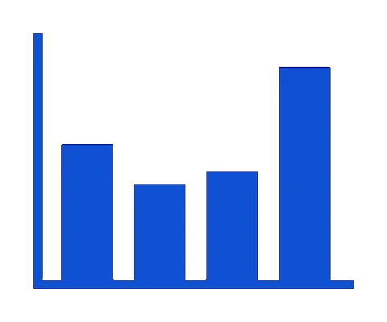

  <h3>
    <span="color:white;">Hi, I'm Adriana Macavei
    
  </h3>

  <h6 font-size="20">
    An Overly Caffinated Computer Scientist.
  </h6>

---

<h3 align="center">
  
  Tech Stack
  
</h3>

<h4>Main Languages</h4>

  
  
  
  
  

<h4>Frontend</h4>

  
  
  

<h4>Backend</h4>

  

<h4>Database</h4>

  

  

<h4>Cloud & Hosting</h4>

  

  

<h4>Version Control & CI/CD</h4>

  
  
  <a href="https://www.docker.com/" target="_blank">
    
  </a href="https://circleci.com/" target="_blank">
    

  

<h4>Preferred IDE & OS & Tool</h4>

  

  
  
 

---

<h3 align="center">
  Portfolio Template
</h3>

  
  <!---
   LAST LEFT OFF 
--->

---

  <h3>
    
    Github Stats
    
  </h3>

  

  

